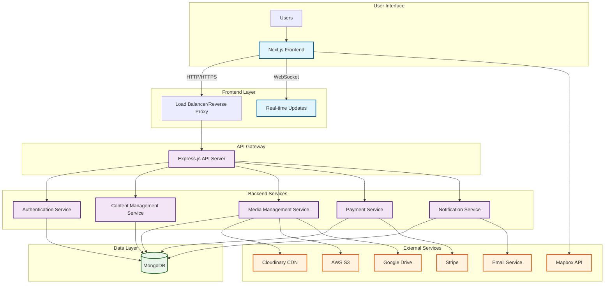
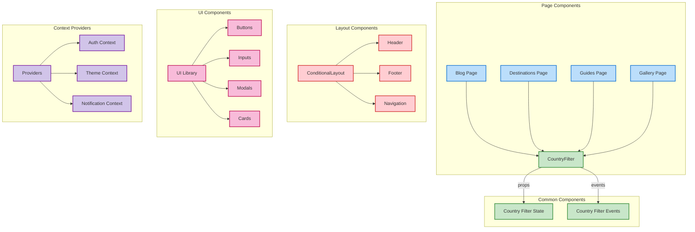
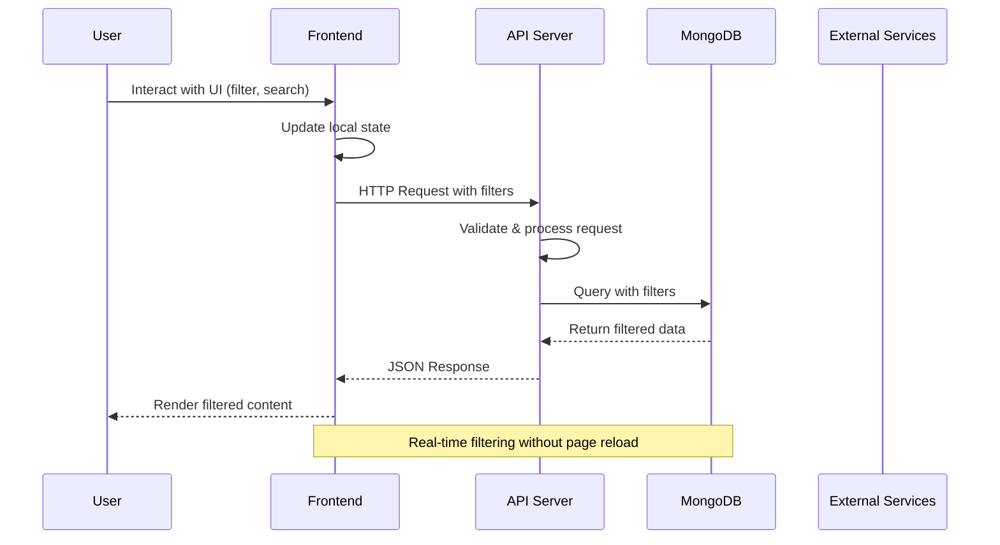
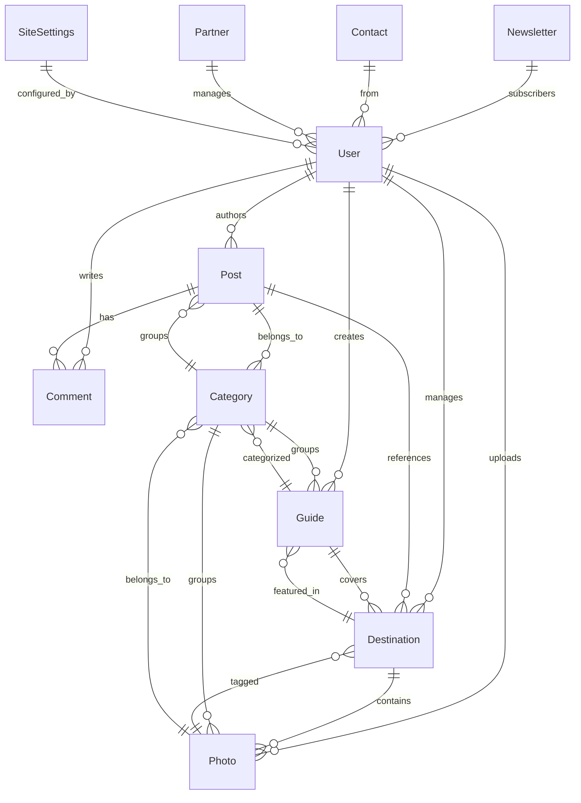
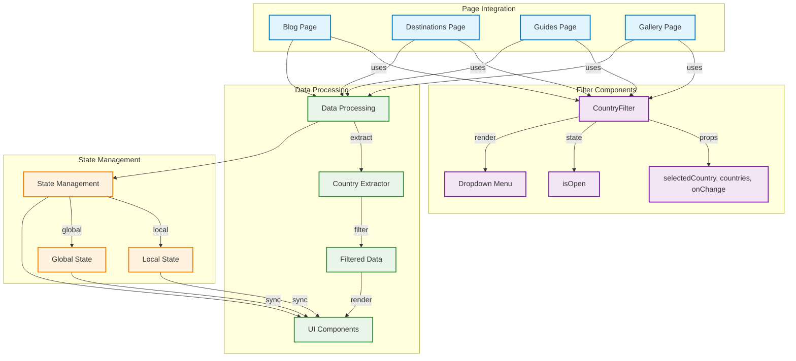
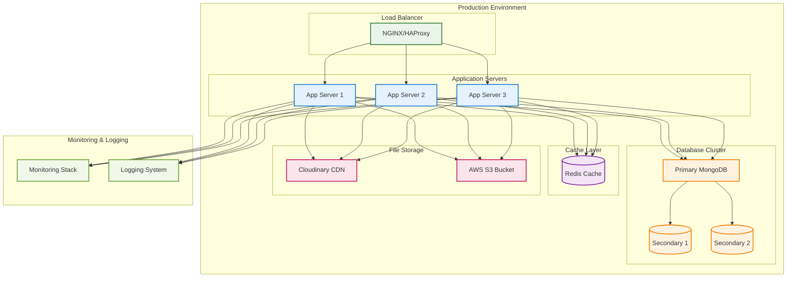
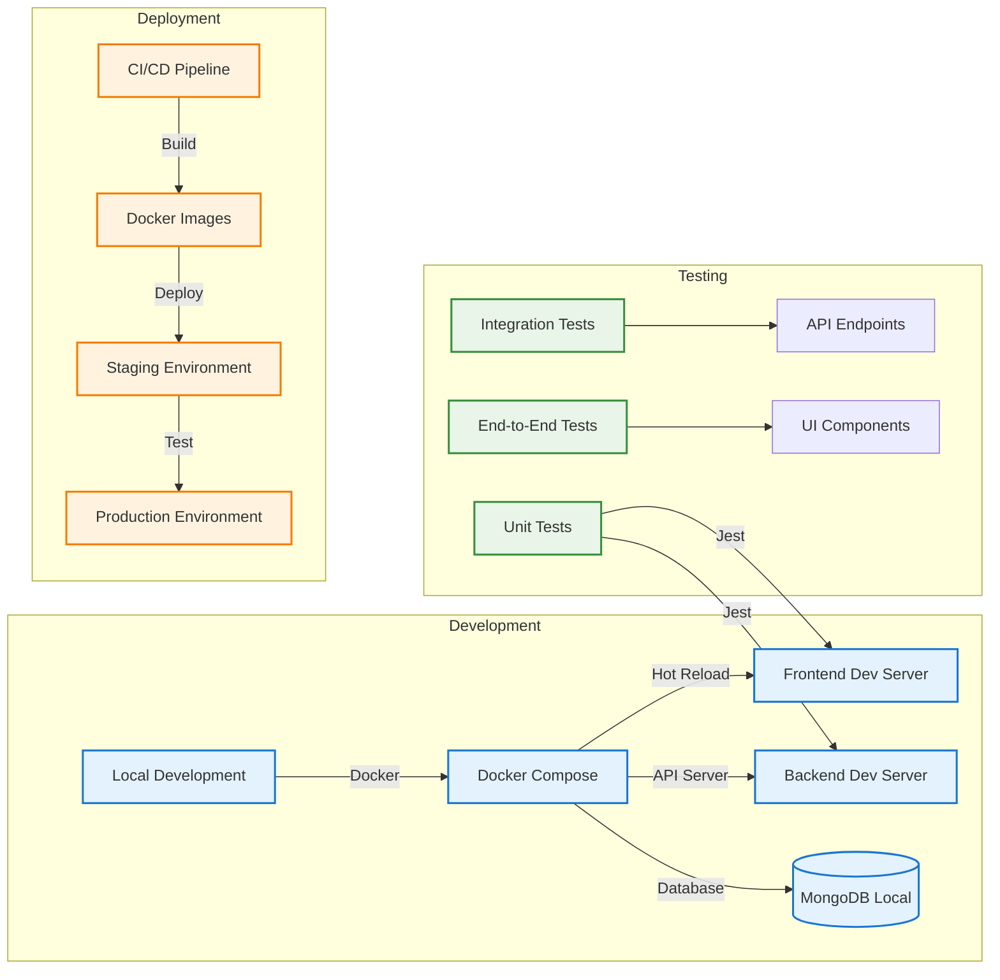

# Travel Blog Application Architecture

## Overview
The Travel Blog is a full-stack web application built with modern technologies, featuring a React/Next.js frontend, Express.js backend, and MongoDB database. The application provides travel content management with advanced filtering capabilities across multiple content types.

## Technology Stack

### Frontend
- **Framework**: Next.js 14 (React 18)
- **Language**: TypeScript
- **Styling**: Tailwind CSS
- **State Management**: React Hooks + Context API
- **Animation**: Framer Motion
- **UI Components**: Custom components with Lucide React icons
- **Maps**: Mapbox GL, React Simple Maps
- **Image Handling**: Cloudinary integration
- **Forms**: React Hook Form
- **Notifications**: React Hot Toast

### Backend
- **Runtime**: Node.js
- **Framework**: Express.js
- **Language**: TypeScript
- **Database**: MongoDB with Mongoose ODM
- **Authentication**: JWT with bcryptjs
- **File Storage**: Cloudinary, AWS S3, Google Drive
- **Email**: Nodemailer
- **Payment**: Stripe integration
- **Security**: Helmet, CORS, Rate Limiting, Mongo Sanitize

### DevOps & Tools
- **Containerization**: Docker
- **Process Management**: PM2 (implied)
- **Linting**: ESLint
- **Testing**: Jest
- **Build Tools**: TypeScript Compiler
- **API Documentation**: (Not specified in code)

## Architecture Diagram



## Component Architecture



## Data Flow Architecture



## Database Schema



## API Architecture

```mermaid
graph LR
    subgraph "API Routes"
        subgraph "Public Routes"
            PR1[/health] --> HC[Health Check]
            PR2[/api/auth/login] --> AL[Auth Login]
            PR3[/api/auth/register] --> AR[Auth Register]
        end

        subgraph "Protected Routes"
            subgraph "Content Routes"
                CR1[/api/posts] --> PL[Posts CRUD]
                CR2[/api/destinations] --> DL[Destinations CRUD]
                CR3[/api/guides] --> GL[Guides CRUD]
                CR4[/api/photos] --> PH[Photos CRUD]
            end

            subgraph "User Routes"
                UR1[/api/users] --> UL[User Management]
                UR2[/api/comments] --> CL[Comments CRUD]
                UR3[/api/categories] --> CAL[Categories CRUD]
            end

            subgraph "Admin Routes"
                AR1[/api/admin] --> ADM[Admin Panel]
                AR2[/api/newsletter] --> NL[Newsletter Management]
                AR3[/api/partners] --> PT[Partner Management]
            end
        end
    end

    subgraph "Middleware Stack"
        MW1[CORS] --> MW2[Rate Limiting]
        MW2 --> MW3[Helmet Security]
        MW3 --> MW4[Mongo Sanitize]
        MW4 --> MW5[Auth Middleware]
        MW5 --> RT[Route Handlers]
    end

    %% Styling
    classDef public fill:#e8f5e8,stroke:#2e7d32,stroke-width:2px
    classDef protected fill:#fff3e0,stroke:#f57c00,stroke-width:2px
    classDef middleware fill:#e3f2fd,stroke:#1976d2,stroke-width:2px

    class PR1,PR2,PR3 public
    class CR1,CR2,CR3,CR4,UR1,UR2,UR3,AR1,AR2,AR3 protected
    class MW1,MW2,MW3,MW4,MW5 middleware
```

## Filter System Architecture



## Deployment Architecture



## Key Features

### Content Management
- **Blog Posts**: Rich text content with categories and destinations
- **Destinations**: Location-based content with maps and photos
- **Travel Guides**: Comprehensive guides with itineraries
- **Photo Gallery**: Image collections with metadata
- **Categories**: Content organization and filtering

### Advanced Filtering
- **Country-wise Filtering**: Available across all content types
- **Category Filtering**: Blog posts, guides, and photos
- **Search Functionality**: Full-text search capabilities
- **Real-time Updates**: Instant filter application

### User Experience
- **Responsive Design**: Mobile-first approach with Tailwind CSS
- **Progressive Web App**: Fast loading and offline capabilities
- **SEO Optimized**: Server-side rendering with Next.js
- **Accessibility**: WCAG compliant components

### Security & Performance
- **Rate Limiting**: Protection against abuse
- **Data Sanitization**: XSS and injection prevention
- **Image Optimization**: Automatic resizing and compression
- **Caching Strategy**: Redis for session and data caching

## Development Workflow



## File Structure

```
TravelBlogWeb/
├── backend/
│   ├── src/
│   │   ├── config/          # Database, Cloudinary config
│   │   ├── controllers/     # Route handlers
│   │   ├── middleware/      # Auth, error handling
│   │   ├── models/          # MongoDB schemas
│   │   ├── routes/          # API endpoints
│   │   ├── utils/           # Helper functions
│   │   └── server.ts        # Main server file
│   ├── Dockerfile.dev
│   └── package.json
├── frontend/
│   ├── src/
│   │   ├── app/             # Next.js pages
│   │   ├── components/      # React components
│   │   ├── context/         # React context
│   │   ├── lib/             # API clients, utilities
│   │   ├── styles/          # Global styles
│   │   ├── types/           # TypeScript types
│   │   └── utils/           # Helper functions
│   ├── Dockerfile.dev
│   └── package.json
├── docker-compose.yml
├── documentation/           # Setup guides
└── README.md
```

This architecture provides a scalable, maintainable, and feature-rich travel blog platform with modern development practices and robust filtering capabilities.</content>
<parameter name="filePath">/Users/pranabpaul/Desktop/Blog/TravelBlogWeb/ARCHITECTURE.md
