# Travel Blog Web Application - Architecture Diagram

```mermaid
graph TB
    %% User Layer
    subgraph "User Interface"
        U[Users] --> FE[Frontend - Next.js]
    end

    %% Frontend Layer
    subgraph "Frontend Layer"
        FE --> |HTTP/HTTPS| API[API Gateway]
        FE --> |WebSocket| WS[WebSocket Server]

        subgraph "Frontend Components"
            FE --> P[Pages]
            FE --> C[Components]
            FE --> H[Hooks]
            FE --> UTL[Utilities]

            P --> BP[Blog Page]
            P --> DP[Destinations Page]
            P --> GP[Guides Page]
            P --> GLP[Gallery Page]
            P --> HP[Home Page]

            C --> CF[Country Filter]
            C --> SB[Search Bar]
            C --> MC[Map Component]
            C --> PC[Post Cards]
            C --> TF[Tag Filter]
            C --> LF[Location Filter]
        end
    end

    %% API Gateway
    subgraph "API Gateway"
        API --> |Route| AUTH[Authentication]
        API --> |Route| POSTS[Posts API]
        API --> |Route| DEST[Destinations API]
        API --> |Route| GUIDES[Guides API]
        API --> |Route| PHOTOS[Photos API]
        API --> |Route| USERS[Users API]
    end

    %% Backend Services
    subgraph "Backend Services"
        AUTH --> JWT[JWT Token Service]
        POSTS --> PC[Posts Controller]
        DEST --> DC[Destinations Controller]
        GUIDES --> GC[Guides Controller]
        PHOTOS --> PHC[Photos Controller]
        USERS --> UC[Users Controller]

        subgraph "Business Logic"
            PC --> PS[Posts Service]
            DC --> DS[Destinations Service]
            GC --> GS[Guides Service]
            PHC --> PHS[Photos Service]
            UC --> US[Users Service]
        end
    end

    %% Database Layer
    subgraph "Database Layer"
        PS --> DB[(MongoDB)]
        DS --> DB
        GS --> DB
        PHS --> DB
        US --> DB

        subgraph "Database Collections"
            DB --> POSTS_COLL[Posts Collection]
            DB --> DEST_COLL[Destinations Collection]
            DB --> GUIDES_COLL[Guides Collection]
            DB --> PHOTOS_COLL[Photos Collection]
            DB --> USERS_COLL[Users Collection]
            DB --> CATEGORIES_COLL[Categories Collection]
            DB --> COMMENTS_COLL[Comments Collection]
        end
    end

    %% External Services
    subgraph "External Services"
        subgraph "File Storage"
            CLOUDINARY[Cloudinary]
            GDRIVE[Google Drive]
        end

        subgraph "Payment"
            STRIPE[Stripe]
        end

        subgraph "Email"
            SENDGRID[SendGrid]
            SMTP[SMTP]
        end

        subgraph "Maps"
            MAPBOX[Mapbox GL JS]
        end

        subgraph "Authentication"
            GOOGLE[Google OAuth]
            FACEBOOK[Facebook OAuth]
        end
    end

    %% Service Connections
    PS --> CLOUDINARY
    PHS --> CLOUDINARY
    PHS --> GDRIVE

    US --> STRIPE
    US --> SENDGRID
    US --> SMTP

    FE --> MAPBOX

    US --> GOOGLE
    US --> FACEBOOK

    %% Data Flow
    U --> |Login/Register| AUTH
    U --> |Browse Content| FE
    FE --> |API Calls| API
    API --> |CRUD Operations| DB
    DB --> |Media Files| CLOUDINARY
    DB --> |Backup Files| GDRIVE

    %% Styling
    classDef frontend fill:#e1f5fe,stroke:#01579b,stroke-width:2px
    classDef backend fill:#f3e5f5,stroke:#4a148c,stroke-width:2px
    classDef database fill:#e8f5e8,stroke:#1b5e20,stroke-width:2px
    classDef external fill:#fff3e0,stroke:#e65100,stroke-width:2px
    classDef user fill:#fce4ec,stroke:#880e4f,stroke-width:2px

    class U user
    class FE,BP,DP,GP,GLP,HP,CF,SB,MC,PC frontend
    class API,AUTH,POSTS,DEST,GUIDES,PHOTOS,USERS,JWT,PC,DC,GC,PHC,UC,PS,DS,GS,PHS,US backend
    class DB,POSTS_COLL,DEST_COLL,GUIDES_COLL,PHOTOS_COLL,USERS_COLL,CATEGORIES_COLL,COMMENTS_COLL database
    class CLOUDINARY,GDRIVE,STRIPE,SENDGRID,SMTP,MAPBOX,GOOGLE,FACEBOOK external
```

## 🏗️ **Travel Blog Web Application Architecture**

### **📋 Overview**
This architecture diagram represents a comprehensive full-stack travel blog application built with modern web technologies.

### **🎯 Key Components**

#### **1. Frontend Layer (Next.js/React)**
- **Framework**: Next.js 14 with App Router
- **Styling**: Tailwind CSS
- **State Management**: React Hooks
- **Animations**: Framer Motion
- **Maps**: Mapbox GL JS & React Simple Maps

#### **2. Backend Layer (Node.js/Express)**
- **Runtime**: Node.js
- **Framework**: Express.js
- **Authentication**: JWT + OAuth
- **Validation**: Middleware-based
- **Error Handling**: Centralized

#### **3. Database Layer (MongoDB)**
- **Database**: MongoDB with Mongoose ODM
- **Collections**: Posts, Destinations, Guides, Photos, Users, Categories, Comments
- **Indexing**: Optimized for search and filtering

#### **4. External Services**
- **File Storage**: Cloudinary (primary) + Google Drive (backup)
- **Payments**: Stripe integration
- **Email**: SendGrid (primary) + SMTP (fallback)
- **Maps**: Mapbox for interactive maps
- **Authentication**: Google & Facebook OAuth

### **🔄 Data Flow**

1. **User Request** → Frontend Components
2. **API Calls** → Backend Controllers
3. **Business Logic** → Service Layer
4. **Database Operations** → MongoDB Collections
5. **File Operations** → Cloudinary/Google Drive
6. **Response** → Frontend → User

### **🛡️ Security Features**

- **JWT Authentication** with refresh tokens
- **OAuth Integration** (Google, Facebook)
- **Input Validation** and sanitization
- **Rate Limiting** and CORS protection
- **Secure File Uploads** with validation
- **Environment-based Configuration**

### **📱 Responsive Design**

- **Mobile-First Approach**
- **Progressive Web App** capabilities
- **Offline Support** for critical features
- **Touch-Optimized** interactions

### **🚀 Performance Optimizations**

- **Server-Side Rendering** (Next.js)
- **Image Optimization** (Next.js Image)
- **Code Splitting** and lazy loading
- **Caching Strategies** (Redis ready)
- **CDN Integration** for assets

### **🔧 Development Features**

- **TypeScript** for type safety
- **ESLint** for code quality
- **Prettier** for code formatting
- **Hot Reload** for development
- **Environment Management**

### **📊 Monitoring & Analytics**

- **Error Tracking** (ready for Sentry)
- **Performance Monitoring**
- **User Analytics** (ready for Google Analytics)
- **SEO Optimization** with meta tags

### **🔄 CI/CD Ready**

- **Docker Support**
- **Environment Configurations**
- **Automated Testing** structure
- **Deployment Scripts**

This architecture provides a scalable, maintainable, and feature-rich foundation for a modern travel blog application with comprehensive country-wise filtering capabilities across all content types (Blog Posts, Destinations, Travel Guides, and Photo Gallery).

---

**Legend:**
- 🔵 Frontend Components
- 🟣 Backend Services
- 🟢 Database Layer
- 🟠 External Services
- 🔴 User Interface
